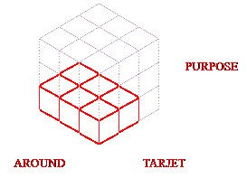

# webCost

## Calculation

How to estimate a web project's cost.

In our calculation method we have divided each of the three main parts into three parts. This model goes, consequently, from a single block for the minimum to twenty-seven blocks for the maximum. The number of blocks is directly related to the annual cost of a project.

The graph not only gives us the result of the effort to be made, it also tells us which direction this effort should go.

<table><tr><td>
The three factors we measure:

- Purpose, the main finality of the site.

- Tarjet, people object of the action.

- Environment, where it will be carried out.

It gives you an idea of cost and related mode.

</td><td>

</td></tr></table>

## Description

An ASP page with Server Side JAVASCRIPT to know a first idea about cost and characteristics of a web project.

## Getting Started

### Dependencies

Runs in Windows IIS server with ASP enabled.

### Installing

Copy this calculate.asp and imgs/ folder in a virtual directory...

### Executing

...and open it. That's all!

## Help

Do not show tooltips text in Android when mouseover images. I don't find an easy solution.

## Authors

This is a very basic piece that I modify in my day to day.

## Version History

Each implementation has its own history.

## License

Free for all and at your own risk

## Acknowledgments

Computer science is a vast field with contributions from numerous individuals, not all of whom are as well-known as Scott Fahlman or Brian Kernighan. Many unsung authors have made significant contributions to the advancement of computer science over the years. Thank you and go ahead.
